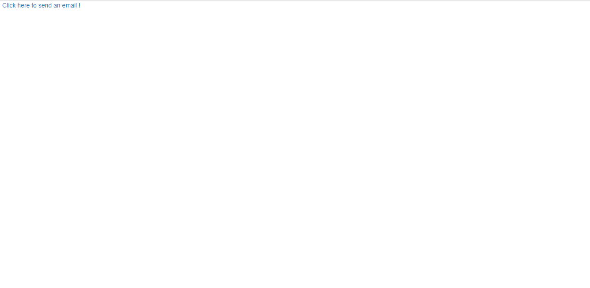

<!-- README.md is generated from README.Rmd. Please edit that file -->

```{r, include = FALSE}
knitr::opts_chunk$set(
  collapse = TRUE,
  comment = "#>",
  fig.path = "man/figures/README-",
  out.width = "100%"
)
```

# mailtoR

<!-- badges: start -->

[](https://CRAN.R-project.org/package=mailtoR)


<!-- badges: end -->

The goal of `mailtoR` is to implement a user interface for emails sending within your Shiny application. It's a wrapper for the [Mailtoui](https://mailtoui.com/#menu) JavaScript library. 

## Installation

You can install the `mailtoR` package from [CRAN](https://CRAN.R-project.org/package=mailtoR) with: 


```{r, eval=FALSE}

install.packages("mailtoR")

```


You can install the development version of `mailtoR` from Github with: 

```{r, eval=FALSE}

# install.packages("remotes")

remotes::install_github("feddelegrand7/mailtoR")


```


## How to use the package 


The `mailtoR` package is composed of two functions: 

+ `use_mailtoR()`: put this function __at the end of your Shiny ui__, it activates the features of the [Mailtoui](https://mailtoui.com/#menu) library;

+ `mailtoR()`: use this function to create as many email links as you want (see examples below)


## Examples: 

```{r, eval=FALSE}

library(shiny)
library(mailtoR)

ui <- fluidPage(


  mailtoR(email = "info@rstudio.com",
          text = "Click here to send an email !"),


  use_mailtoR()


)

server <- function(input, output) {}

shinyApp(ui = ui, server = server)


```



You can use many parameters to configure your email framework: 


```{r, eval=FALSE}

library(shiny)
library(mailtoR)

ui <- fluidPage(


  mailtoR(email = "michaelscott@dundermifflin.org",
          text = "click here to send an email", 
          subject = "URGENT", 
          cc = c("jimhalpert@dundermifflin.org", "dwightschrute@dundermifflin.org"), 
          body = "Hi Michaels, it's David Wallace, your branch needs to make more sales !!!!!!!"),


  use_mailtoR()


)

server <- function(input, output) {}

shinyApp(ui = ui, server = server)


```


Using the [glue](https://CRAN.R-project.org/package=glue) package, you can ever create a reproducible text report that you'll embed within your email: 


```{r, eval=FALSE}

library(shiny)
library(mailtoR)

ui <- fluidPage(


  mailtoR(email = "random_person@random.org",
          text = "click here to send an email", 
          subject = "Useful Information", 
          body = glue::glue(
          
          "
Hi,
          
Did you know that the mtcars dataset has {nrow(mtcars)} rows and {ncol(mtcars)} columns ? 
            
Best regards. 
            
            "
            
            
            
          )),


  use_mailtoR()


)

server <- function(input, output) {}

shinyApp(ui = ui, server = server)


```


## Code of Conduct

Please note that the mailtoR project is released with a [Contributor Code of Conduct](https://contributor-covenant.org/version/2/0/CODE_OF_CONDUCT.html). By contributing to this project, you agree to abide by its terms.


