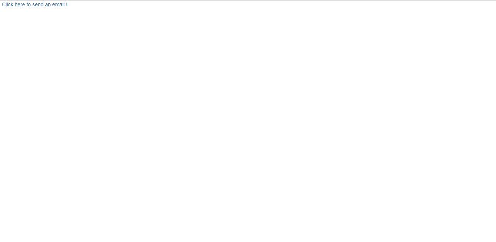
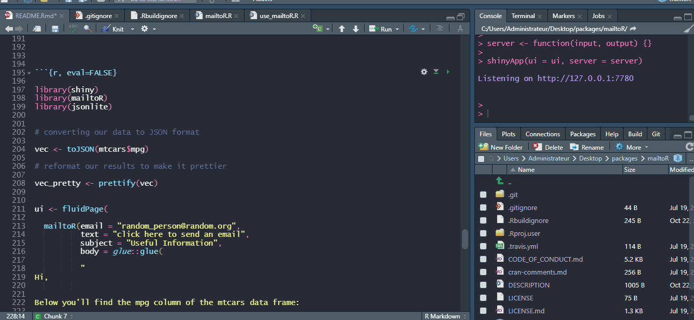

<!-- README.md is generated from README.Rmd. Please edit that file -->

# mailtoR

<!-- badges: start -->

[](https://cran.r-project.org/package=mailtoR)

[](https://cran.r-project.org/package=mailtoR)

[](https://cran.r-project.org/package=mailtoR)

[](https://cran.r-project.org/package=mailtoR)

[](https://choosealicense.com/licenses/mit/)

[](https://travis-ci.com/feddelegrand7/mailtoR)

[](https://github.com/feddelegrand7/mailtoR)

<!-- badges: end -->

The goal of `mailtoR` is to implement a personalized user interface for
emails sending within your Shiny applications and/or RMarkdown
documents. It’s a wrapper of the [Mailtoui](https://mailtoui.com/#menu)
JavaScript library.

## Installation

You can install the `mailtoR` package from
[CRAN](https://CRAN.R-project.org/package=mailtoR) with:

``` r

install.packages("mailtoR")
```

You can install the development version of `mailtoR` from Github with:

``` r

# install.packages("remotes")

remotes::install_github("feddelegrand7/mailtoR")
```

## How to use the package

The `mailtoR` package is composed of two functions:

  - `use_mailtoR()`: put this function **at the end of your Shiny ui** (doesn't matter in RMarkdown),
    it activates the features of the
    [Mailtoui](https://mailtoui.com/#menu) library;

  - `mailtoR()`: use this function to create as many email links as you
    want (see examples below)

#### The following examples are provided in Shiny coding however the principles remain the same for RMarkdown documents.

## Examples:

``` r

library(shiny)
library(mailtoR)

ui <- fluidPage(


  mailtoR(email = "info@rstudio.com",
          text = "Click here to send an email !"),


  use_mailtoR()


)

server <- function(input, output) {}

shinyApp(ui = ui, server = server)
```



You can use many parameters to configure your email framework:

``` r

library(shiny)
library(mailtoR)

ui <- fluidPage(


  mailtoR(email = "michaelscott@dundermifflin.org",
          text = "click here to send an email", 
          subject = "URGENT", 
          cc = c("jimhalpert@dundermifflin.org", "dwightschrute@dundermifflin.org"), 
          body = "Hi Michaels, it's David Wallace, your branch needs to make more sales !!!!!!!"),


  use_mailtoR()


)

server <- function(input, output) {}

shinyApp(ui = ui, server = server)
```


Using the [glue](https://CRAN.R-project.org/package=glue) package, you
can ever create a reproducible text report that you’ll embed within your
email:

``` r

library(shiny)
library(mailtoR)

ui <- fluidPage(


  mailtoR(email = "random_person@random.org",
          text = "click here to send an email", 
          subject = "Useful Information", 
          body = glue::glue(
          
          "
Hi,
          
Did you know that the mtcars dataset has {nrow(mtcars)} rows and {ncol(mtcars)} columns ? 
            
Best regards. 
            
            "
            
            
            
          )),


  use_mailtoR()


)

server <- function(input, output) {}

shinyApp(ui = ui, server = server)
```


If you want to send a vector of data you’ll need to use `mailtoR` in
conjunction with the `jsonlite` package.

``` r

library(shiny)
library(mailtoR)
library(jsonlite)


# converting our data to JSON format

vec <- toJSON(mtcars$mpg)

# reformat our results to make it prettier 

vec_pretty <- prettify(vec)


ui <- fluidPage(

  mailtoR(email = "random_person@random.org",
          text = "click here to send an email", 
          subject = "Useful Information", 
          body = glue::glue(
          
          "
Hi,
          

Below you'll find the mpg column of the mtcars data frame: 

{vec_pretty}

Best regards
            
            "
            
          )),


  use_mailtoR()


)

server <- function(input, output) {}

shinyApp(ui = ui, server = server)
```



## Code of Conduct

Please note that the mailtoR project is released with a [Contributor
Code of
Conduct](https://contributor-covenant.org/version/2/0/CODE_OF_CONDUCT.html).
By contributing to this project, you agree to abide by its terms.
